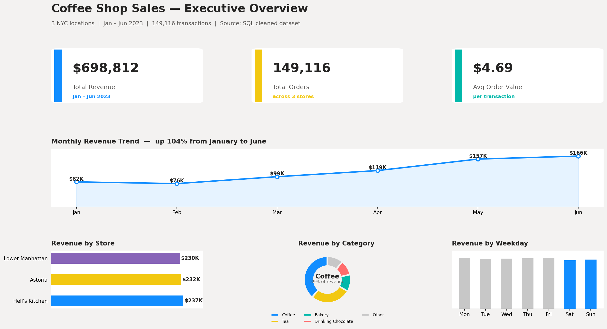
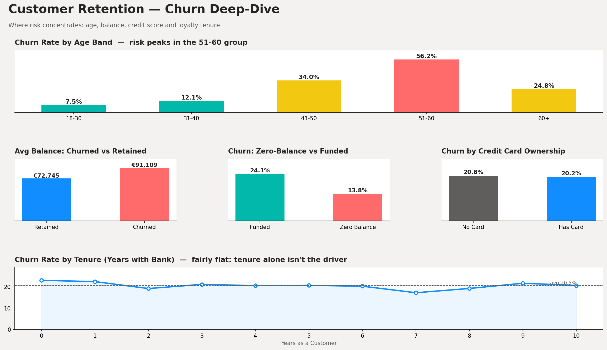

#PORTFOLIO
Welcome to my portfolio.I am Emmanuel Agyemang an Msc International Economics student at the universite de Orleans.The below projects hightlight some of my skills and experiences 

# I.Customer Retention Analysis — SQL and Power BI

Reducing bank customer churn by turning two messy spreadsheet exports into a clean data model and two focused Power BI dashboards.

## The Problem

A retail bank was losing roughly 1 in 5 customers a year, and nobody could say exactly why. The raw data lived in two linked spreadsheets full of the usual real-world mess that consists of inconsistent country spellings, currency symbols stored as text, a duplicate record. So, before anyone could ask "why are people leaving," the data had to be trustworthy first. This project cleans that data with SQL, then surfaces the patterns that actually predict churn.

## Dataset

10,000 bank customers with demographics (age, gender, geography), account details (balance, tenure, products held, credit card status) and a churn flag. Sourced from two linked tables:

- Customer_Info — 10,001 rows, mixed geography spellings (France / FRA/ French)
- Account_Info — 10,002 rows, balances stored as text (€159660.8), one duplicate CustomerId

## Tools Used

| Tool | Role |
|---|---|
| **SQL** | Cleaning, standardising, and joining the raw tables into one analysis-ready table |
| **Power BI** | Data modelling, DAX measures, and the two dashboard pages |
| **Excel** | Quick sense-checks on the raw exports before writing the cleaning logic |

## Process

1. **Clean** — strip currency symbols, standardise geography spellings, convert `Yes/No` flags to `1/0`, drop the duplicate record → [`SQL/01_data_cleaning.sql`](SQL/01_data_cleaning.sql)
2. **Join** — merge the two source tables into a single `Churn_Master` table (10,001 + 10,002 messy rows → exactly 10,000 clean, unique customers)
3. **Analyse** — KPI, segment, and risk-list queries that power both dashboards → [`SQL/02_churn_analysis_queries.sql`](SQL/02_churn_analysis_queries.sql)
4. **Visualise** — load [`Data/Churn_Master_Cleaned.csv`](Data/Churn_Master_Cleaned.csv) into Power BI, build DAX measures ([`PowerBI/DAX_Measures.txt`](PowerBI/DAX_Measures.txt)), and design two report pages

## Dashboards

**Executive Overview** — headline KPIs, churn by geography, activity status, gender, and number of products held

**Churn Deep-Dive** — churn by age band, balance comparison, zero-balance vs funded accounts, credit card ownership, and tenure trend

## Key Insights

- Overall churn sits at **20.4%** — high enough to matter, but concentrated in a few clear pockets rather than spread evenly
- **Product count is the strongest signal in the data**: churn is just 7.6% at 2 products, but jumps to 82.7% at 3 and 100% at 4 — over-selling without matching service is actively pushing people out
- **Germany churns at 32.4%**, roughly double France and Spain.This points to a market-specific issue, not a random blip
- **Inactive members churn almost twice as often** as active ones (26.9% vs 14.3%), and churned customers carry *higher* average balances (€91K vs €73K). The bank is often losing its more valuable, disengaged customers
- **Risk climbs sharply with age**, peaking at 56.2% in the 51-60 band, while tenure alone barely moves the needle

## Recommendations

- Cap or review any push toward 3+ products per customer. That's where churn goes from manageable to near-certain
- Run a targeted engagement campaign for inactive, mid-to-high-balance members before they leave
- Investigate the German market specifically. Pricing, service quality, or local competition are the likely drivers
- Route the SQL-generated high-risk customer list (still-active, single product, inactive, or 51-60 with a healthy balance) to the retention team monthly
